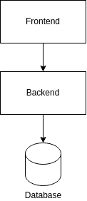

# eregold - 01 Basic web app

This version of the **Eregold** application is a simple, one jar web application and database.
This kind of application is not really suitable for banking anymore, but it should serve as a starting point for
everyone interested in how web application communicates from top to bottom.

---
## How to run
### Requirements
- Docker
#### Optional
- Java 11
- Maven 3.6
- NodeJS 14.17.5
- Npm 6.14.14

### Steps
1. Run **docker-compose -f docker-compose-complete.yml up** in this directory
2. Application will be available on **localhost:4200**
3. You can create your own user with fake data, for simplicity there is no validation except for *repeat password* matching 

## Architecture

The architecture is the simplest possible one:

- Backend 
  - is stateful - the user session is stored in application memory,
  - connects directly into database
- Frontend
  - is bundled with the jar, and not run standalone,
  - connects directly to backend
- Database
  - everything is in one database 