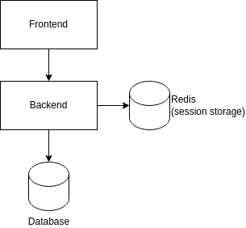

# eregold - 02 Stateless web app

This version of the **Eregold** application is a simple, one jar web application and database. The difference from 
[Version 01](https://github.com/DigitalCrafting/eregold/tree/master/01-basic-web-app) is that session is stored in Redis, 
thus enabling of starting and stopping instances without necessity of logging in again.

This kind of application is not really suitable for banking anymore, but it should serve as a starting point for
everyone interested in how web application communicates from top to bottom.

---
## How to run
### Requirements
- Java 11
- Maven
- Docker
#### Optional

- NodeJS 14.17.5
- Npm 6.14.14

### Steps
1. Run **mvn clean install -Pprod** in backend directory
2. Run **docker-compose up** in this directory
3. Run **mvn flyway:migrate** in database directory
4. Application will be available on **localhost:4200**

## Architecture

The architecture is as follows:

- Backend 
  - is stateless - the user session is stored Redis,
  - connects directly into database
- Frontend
  - is bundled with the jar, and not run standalone,
  - connects directly to backend
- Database
  - everything is in one database 