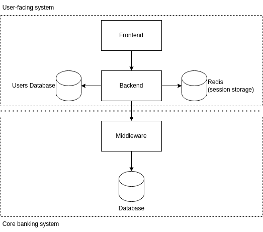

# eregold - 03 Stateless web app plus monolith middleware

This version of the **Eregold** application is a bit more complicated. The difference from 
[Version 02](https://github.com/DigitalCrafting/eregold/tree/master/02-stateless-web-app) is that backend no longer 
connects directly to the full database. Instead, backend has access only to Users Database, which only stores application user data,
while the core banking functionality is behind another system called 'Middleware'. The purpose of middleware
is to provide common API for accessing the database, for all different banking applications, like User Application (eregold), Call Center Application, CRM etc.  

This kind of application, with a bit more security, is what can be found in the professional systems, although [microresvices middleware](https://github.com/DigitalCrafting/eregold/tree/master/04-web-app-plus-microservice-middleware) would be considered a modern system.

---
## How to run
### Requirements
- Docker
#### Optional
- Java 11
- Maven
- NodeJS 14.17.5
- Npm 6.14.14

### Steps
1. Run **docker-compose -f docker-compose-complete.yml up** in this directory
2. Application will be available on **localhost:4200**
3. You can create your own user with fake data, for simplicity there is no validation except for *repeat password* matching

## Architecture

The architecture is as follows:

- Backend 
  - is stateless - the user session is stored Redis,
  - connects to Users Database,
  - connects to Middleware in order to access customer data like accounts, and transactions,
- Frontend
  - is bundled with the jar, and not run standalone,
  - connects directly to backend
- Users Database
  - stores user-specific data (login, password)
- Middleware
  - common API for core banking functionality, all access to database is though it
- Database
  - core banking database, 
  - contains customer related data like accounts, transactions etc.