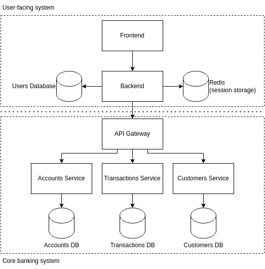

# eregold - 04-web-app-plus-microservice-middleware [WIP]

This version of the **Eregold** application is the most complicated one. The difference from 
[Version 03](https://github.com/DigitalCrafting/eregold/tree/master/03-web-app-plus-monolith-middleware) is that middleware is no longer a monolithic application,
but a microservices system, each microservice having it's own database, which makes sense since there will way more transactions than customers, which
also will need more servers to handle.

This kind of application, with a bit more security, is what modern-day commercial systems look like, but it's not always good to go straight to microservices.
Although they provide scalability, loose coupling and agility in deploying just part of your system, it's also why they have much bigger overhead when it comes 
to managing them.

I would suggest starting with [Monolithic Middleware](https://github.com/DigitalCrafting/eregold/tree/master/03-web-app-plus-monolith-middleware)
and only going to microservices when and where you need them. For example: extracting only the transactions part as a separate service, since it will need more scalability and database space.

---
## How to run
### Requirements
- Java 11
- Maven
- Docker
#### Optional

- NodeJS 14.17.5
- Npm 6.14.14

### Steps (TODO script)
1. Run **mvn clean install -Pprod** in backend directory
1. Run **mvn clean install** in middleware directory
2. Run **docker-compose up** in this directory
3. Run **mvn flyway:migrate** in each (accounts, customers, transactions, users) database directory
4. Application will be available on **localhost:4200**

## Architecture

The architecture is as follows:

- User Facing System
  - Backend 
    - is stateless - the user session is stored Redis,
    - connects to Users Database,
    - connects to Core Banking System in order to access customer data like accounts, and transactions,
  - Frontend
    - is bundled with the jar, and not run standalone,
    - connects directly to backend
  - Users Database
    - stores user-specific data (login, password)
- Core Banking System
  - API Gateway
    - single point of entry to Core System,
    - also acts as a service discovery and load balancer
  - Accounts
    - Accounts Service
      - microservice handling accounts related operations
    - Accounts DB
      - contains accounts related tables
  - Transactions
    - Transactions Service
      - microservice handling transactions related operations
    - Transactions DB
      - contains transactions related tables
  - Customers
    - Customers Service
      - microservice handling customers related operations
    - Customers DB
      - contains customers related tables