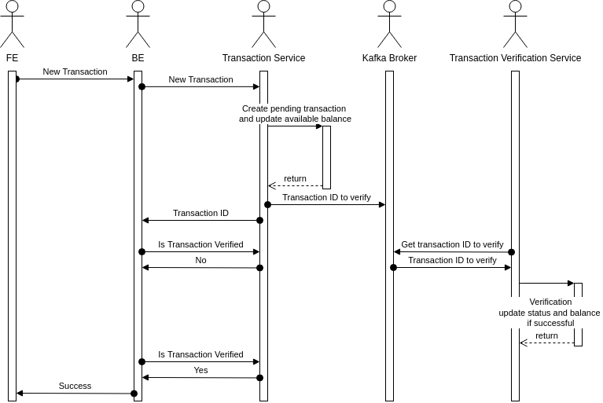

# eregold - 05-microservices-plus-kafka-transactions-system - WIP

This version of the **Eregold** application is the most complicated one. The difference from 
[Version 04](https://github.com/DigitalCrafting/eregold/tree/master/04-web-app-plus-microservice-middleware) is that the transactions system will be expanded to use Kafka pub-sub model, to properly check if the transaction can be done and that the account balance is correctly updated.
The udpated transaction flow will be as in the below diagram:

This flow will be much closer to what it can look like in the real world. It's not perfect, but it's enough for our simple banking application and the main goal of this is to show the usecase for Kafka.

So the flow is as follows:
1. User fills the data for new transfer and clicks "Transfer",
2. Request is made to Backend,
3. Backend forwards *NewTransactionRequest* to **Transaction Service**
   1. Backend will receive **TransactionId** in response,
   2. And will periodically check if the transactions state changed to *ACCEPTED* or *REJECTED*,
   3. Then it will return to frontend
4. Transaction service will
   1. Create **TransactionId**,
   2. Create new transaction with status *PENDING*,
   3. Make a call to **Accounts Service** to update *availableBalance* of the account,
   4. Push the new transaction to Kafka Broker,
   5. Return **TransactionId** to Backend.
5. Transaction Verification Service will
   1. Get the new transaction to verify,
   2. If the transaction is a deposit, it will be accepted immediately,
   3. Perform simple verification if the user has enough money in the account and will check the whole account history for that,
   4. On success will change the status of transaction to *ACCEPTED*, add destination transaction and update the balances,
   5. On reject it will update status to *REJECTED* and restore *availableBalance* to before the transaction. 

Obviously, waiting for the transaction to be processed before going back to user might take too long in a real world but it's good enough for our example, when running on localhost.

In a real world scenario, I would probably return to frontend right after the *availableBalance* is updated and pending transaction is in database, and show it as pending. Then I would use the **transactionId** to check the status in the background, and when it's done, I would update the frontend, as long as user is in the application.

I might even implement it one day :)

---
## How to run
### Requirements
- Java 11
- Maven
- Docker
#### Optional
- NodeJS 14.17.5
- Npm 6.14.14

### Steps
#### Linux
1. Run **build.sh** script
2. Run **docker-compose up**
4. Run **migrate_db.sh** script
5. Application will be available on **localhost:4200**

#### Windows
1. Run **mvn clean install -Pprod** in backend directory
2. Run **mvn clean install** in in each (accounts, api-gateway, customers, transactions) microservice directory
3. Run **docker-compose up** in this directory
4. Run **mvn flyway:migrate** in each (accounts, customers, transactions, users) database directory
5. Application will be available on **localhost:4200**

## Architecture

The architecture is as follows:

- User Facing System
  - Backend 
    - is stateless - the user session is stored Redis,
    - connects to Users Database,
    - connects to Core Banking System in order to access customer data like accounts, and transactions,
  - Frontend
    - is bundled with the jar, and not run standalone,
    - connects directly to backend
  - Users Database
    - stores user-specific data (login, password)
- Core Banking System
  - API Gateway
    - single point of entry to Core System,
    - also acts as a service discovery and load balancer
  - Accounts
    - Accounts Service
      - microservice handling accounts related operations
    - Accounts DB
      - contains accounts related tables
  - Transactions
    - Transactions Service
      - microservice handling transactions related operations
    - Transaction Verification Service
      - microservice handling transaction verification, and balance update
      - **Important!** This service connects directly to 2 databases simply because I wanted to have an example on how to connect to multiple databases from one service
    - Transactions DB
      - contains transactions related tables
  - Customers
    - Customers Service
      - microservice handling customers related operations
    - Customers DB
      - contains customers related tables
  - Kafka Broker
    - queue system